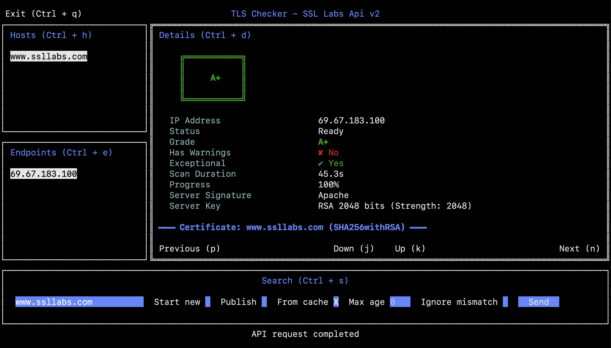

# TLS Checker


A Terminal User Interface (TUI) application for analyzing SSL/TLS configurations of domains using the SSL Labs API V2. Get comprehensive security ratings, certificate details, and cryptographic information directly from your terminal.

## 📸 Screenshot


*TLS Checker showing SSL Labs analysis for www.ssllabs.com with A+ rating*

> **Note:** The interface displays host information, endpoints, detailed certificate data, and server configuration in an easy-to-navigate TUI.

## ✨ Features

- 🔍 **SSL/TLS Analysis** - Comprehensive security analysis using SSL Labs API v2
- 📊 **Grade Rating** - View security grades (A+, A, B, C, etc.) for your domains
- 🔐 **Certificate Details** - Inspect certificate chains, signatures, and key strengths
- 🌐 **Multiple Endpoints** - Analyze all IP addresses associated with a domain
- 🎨 **Interactive TUI** - Beautiful terminal interface built with tview
- ⌨️  **Keyboard Navigation** - Efficient keyboard shortcuts for all operations
- 💾 **Host History** - Keep track of previously scanned hosts
- 🚀 **Fast & Lightweight** - Native Go performance with minimal dependencies

## 📋 Requirements

- **Go:** 1.25.6 or higher
- **Terminal:** Any modern terminal emulator with 256 color support
- **Internet Connection:** Required for SSL Labs API access

## 🚀 Installation

### From Source

```bash
# Clone the repository
git clone https://github.com/Juansebas064/tls-checker.git
cd tls-checker

# Download dependencies
go mod download

# Build the application
go build -o tls-checker cmd/main.go

# Run the application
./tls-checker
```
## 📖 Usage

### Basic Usage

Simply run the application:

```bash
./tls-checker
```

### Application Workflow

1. **Enter a hostname** in the search field (e.g., `www.example.com`)
2. **Configure options** (optional):
   - Start new: Force a new scan
   - Publish: Publish results to SSL Labs
   - From cache: Use cached results if available
   - Max age: Specify maximum age (in hours) for cached results
   - Ignore mismatch: Ignore certificate name mismatch
3. **Press Send** to initiate the scan
4. **Navigate** between sections using keyboard shortcuts
5. **View details** for each endpoint by selecting it

### Keyboard Shortcuts

| Shortcut | Action |
|----------|--------|
| `Ctrl + q` | Exit application |
| `Ctrl + h` | Focus on Hosts section |
| `Ctrl + e` | Focus on Endpoints section |
| `Ctrl + d` | Focus on Details section |
| `Ctrl + s` | Focus on Search |
| `p` | Previous endpoint (in details view) |
| `n` | Next endpoint (in details view) |
| `j` / `↓` | Navigate down in lists |
| `k` / `↑` | Navigate up in lists |
| `Tab` | Navigate between form fields |
| `Enter` | Select item / Submit form |

## 📁 Project Structure

```
tls-checker/
├── cmd/
│   └── main.go                 # Application entry point
├── internal/
│   ├── api/
│   │   ├── client.go          # SSL Labs API client
│   │   └── client_test.go     # API client tests
│   ├── model/
│   │   ├── analyze_host_query.go  # Query parameters model
│   │   ├── endpoint.go            # Endpoint data model
│   │   └── host.go                # Host data model
│   ├── ui/
│   │   ├── actions.go         # UI action handlers
│   │   ├── application.go     # Main application structure
│   │   ├── events.go          # Event handlers
│   │   ├── keyboard.go        # Keyboard shortcuts
│   │   └── layout.go          # UI layout configuration
│   └── utils/
│       ├── colors.go          # Color utilities
│       └── formatter.go       # Data formatting helpers
├── go.mod                      # Go module definition
├── go.sum                      # Dependency checksums
├── analyzeResponse.json        # Sample API response
└── README.md                   # This file
```

### Architecture

- **cmd/**: Contains the application entry point
- **internal/api/**: SSL Labs API client implementation
- **internal/model/**: Data models for API requests and responses
- **internal/ui/**: TUI components, layout, and event handling
- **internal/utils/**: Utility functions for formatting and colors

## 🔌 API Reference

This application uses the [SSL Labs API v2](https://github.com/ssllabs/ssllabs-scan/blob/master/ssllabs-api-docs-v2-deprecated.md).

### Key Endpoints Used

- **GET /api/v2/analyze** - Analyze a host's SSL/TLS configuration

### Rate Limiting

Please be aware of SSL Labs API rate limits:
- Maximum 25 assessments per client at any time
- Maximum 25 new assessments per hour
- Please cache results appropriately

## 📦 Dependencies

| Package | Version | Purpose |
|---------|---------|---------|
| [rivo/tview](https://github.com/rivo/tview) | v0.42.0 | Terminal UI framework |
| [gdamore/tcell](https://github.com/gdamore/tcell) | v2.8.1 | Terminal handling library |

## 📄 License

This project is licensed under the MIT License - see the [LICENSE](LICENSE) file for details.

## 📚 References

* [SSL Labs API Documentation](https://github.com/ssllabs/ssllabs-scan/blob/master/ssllabs-api-docs-v2-deprecated.md)
* [Go Official Tutorial](https://go.dev/doc/tutorial/)
* [Go Tour - Flow Control](https://go.dev/tour/flowcontrol)
* [Consuming RESTful APIs with Go](https://tutorialedge.net/golang/consuming-restful-api-with-go/)
* [tview Documentation](https://pkg.go.dev/github.com/rivo/tview#section-readme)
* [tview GitHub Repository](https://github.com/rivo/tview)
* [Go Testing Tutorial](https://go.dev/doc/tutorial/add-a-test)
* [Building a Go CLI - YouTube](https://www.youtube.com/watch?v=8uiZC0l4Ajw)
* [ I created a real terminal user interface (TUI) application in Golang. ](https://www.youtube.com/watch?v=aiWOTYiIzyE&t=102s)

